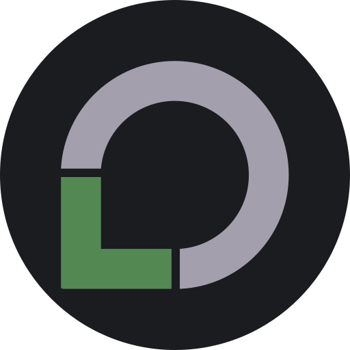
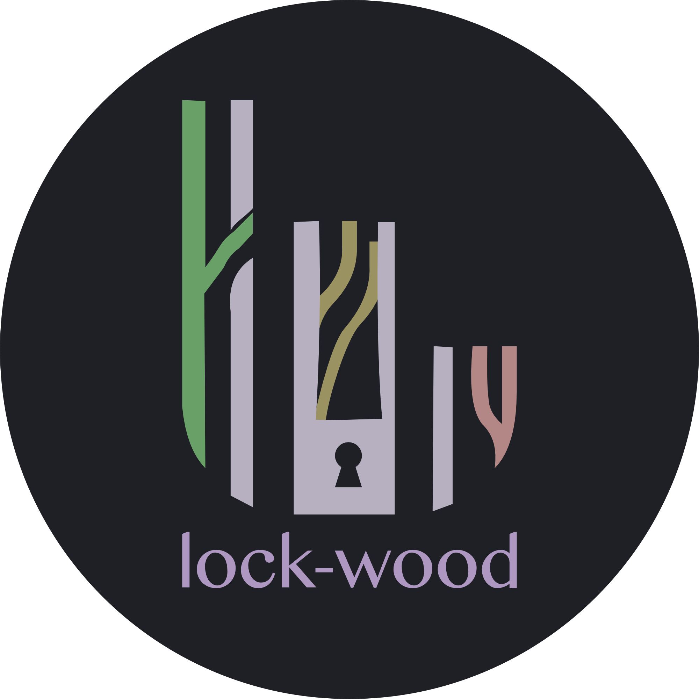
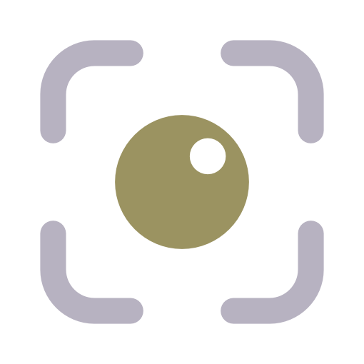
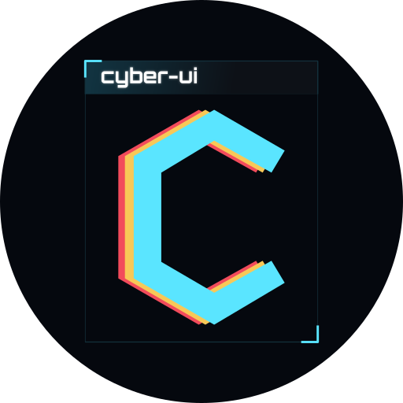
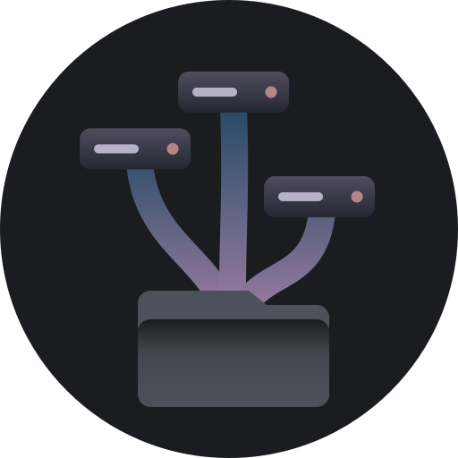
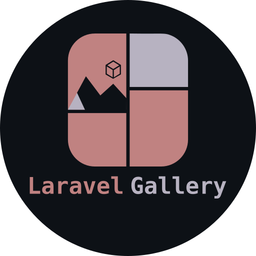
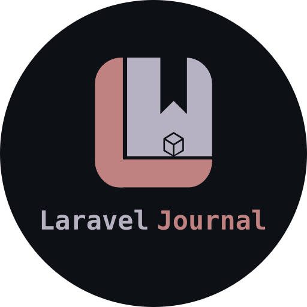

**Jakub Gawlik** &nbsp;|&nbsp;
&nbsp;<small>[caasi.dev](https://caasi.dev)</small>

**Software Engineer** &nbsp;·&nbsp; UK

I build modern web applications, APIs, and developer tools  with a focus on
clean architecture and practical solutions.

[Website](https://caasi.dev) &nbsp;·&nbsp;
[LinkedIn](https://www.linkedin.com/in/jakub-gawlik-11018a258/) &nbsp;·&nbsp;
[X](https://x.com/jacob_gawlik)

 

## Tech Stack

<table>
  <tr>
    <td><b>BACKEND</b></td>
    <td>
      
      
      
      
      
    </td>
  </tr>
  <tr>
    <td><b>FRONTEND</b></td>
    <td>
      
      
      
      
    </td>
  </tr>
  <tr>
    <td><b>DEVOPS &amp; TOOLS</b></td>
    <td>
      
      
      
      
    </td>
  </tr>
</table>

## Projects

<table>
  <tr>
    <td width="18%" align="center" valign="middle">
      
    </td>
    <td width="44%" valign="middle">
      <b>lockORG</b> - <small>(in development)</small> 
      Powerful tools in one secure platform. All your productivity needs covered with uncompromising privacy.
    </td>
    <td width="18%" align="center" valign="middle" nowrap>
       
     <!--  -->
    </td>
    <td width="20%" align="center" valign="middle">
      
      
      
    </td>
  </tr>
  <tr>
    <td align="center" valign="middle">
      
    </td>
    <td valign="middle">
      <b>lock-wood</b> 
      A calm, muted dark colour scheme for people who stare at code all day.
      Easy on the eyes, everywhere you work.
    </td>
    <td align="center" valign="middle" nowrap>
      <!--   -->
       
       
    </td>
    <td align="center" valign="middle">
      
      
      
      
    </td>
  </tr>
  <tr>
    <td width="18%" align="center" valign="middle">
      
    </td>
    <td width="44%" valign="middle">
      <b>lenslite</b> 
      The gesture-first lightbox. Mobile-first, dependency-free, and small enough to forget it’s there — until someone pinches a photo and it just feels right.
    </td>
    <td width="18%" align="center" valign="middle" nowrap>
       
       
       
     <!--  -->
    </td>
    <td width="20%" align="center" valign="middle">
      
      
    </td>
  </tr>
  <tr>
    <td width="18%" align="center" valign="middle">
      
    </td>
    <td width="44%" valign="middle">
      <b>cyber-ui</b> 
      A cyberpunk / Stellaris inspired interface kit: a zero-JS CSS core plus Lit web components. One stylesheet, any framework, five built-in themes.
    </td>
    <td width="18%" align="center" valign="middle" nowrap>
       
       
       
     <!--  -->
    </td>
    <td width="20%" align="center" valign="middle">
      
      
      
    </td>
  </tr>
  <tr>
    <td align="center" valign="middle">
      
    </td>
    <td valign="middle">
      <b>hydrabak</b> 
      A small, dependency-free bash script that mirrors a list of source paths to a list of destination drives.
    </td>
    <td align="center" valign="middle" nowrap>
      <!--   -->
      
    </td>
    <td align="center" valign="middle">
      
      
    </td>
  </tr>
  <tr>
    <td align="center" valign="middle">
      
    </td>
    <td valign="middle">
      <b>laravel-gallery</b> 
      Drop-in image galleries for Laravel. My first venture into framework
      package development — built to scratch my own itch, shared in case it scratches yours.
    </td>
    <td align="center" valign="middle" nowrap>
      <!--   -->
       
      
    </td>
    <td align="center" valign="middle">
      
      
      
    </td>
  </tr>
  <tr>
    <td align="center" valign="middle">
      
    </td>
    <td valign="middle">
      <b>laravel-journal</b> 
      A private, per-user journal JSON API for Laravel: posts, categories and tags, with search, sorting and pagination
    </td>
    <td align="center" valign="middle" nowrap>
      <!--   -->
       
      
    </td>
    <td align="center" valign="middle">
      
      
      
    </td>
  </tr>
</table>

## Outside of Code

When I'm not building software, you'll usually find me exploring photography,
hiking and wild camping, listening to fantasy audiobooks, or working on fitness
and nutrition goals.

 

  Thanks for stopping by.

